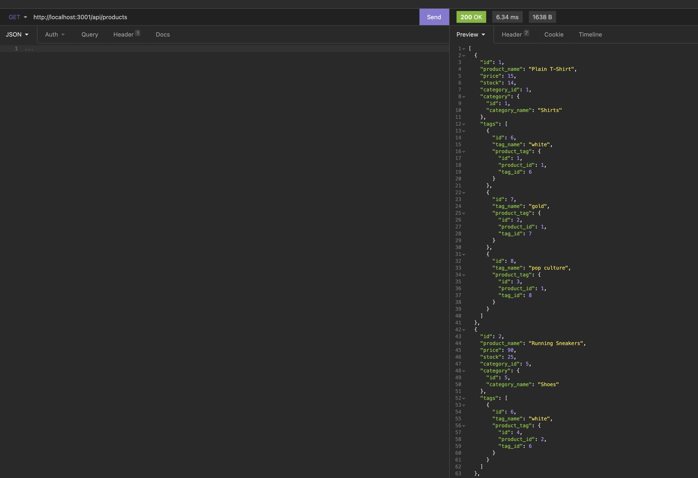
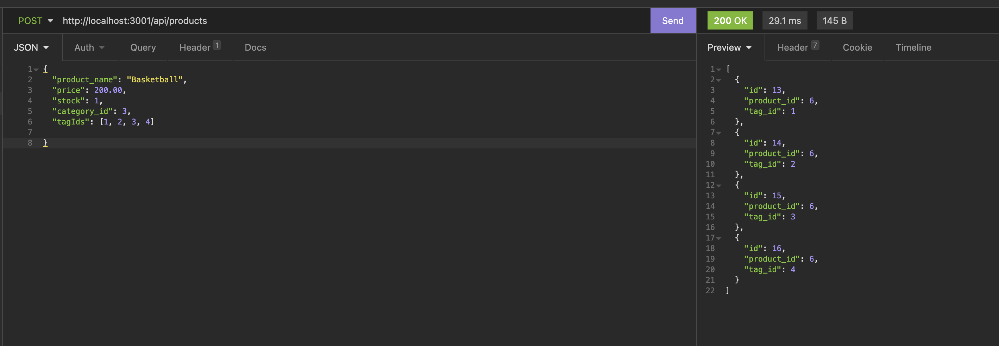

# Ecommerce-backend

  
  
  ## Table of Contents
  -[Project Description](#projectDescription)
  -[Table of Contents](#tableofContents)
  -[Installation](#installation)
  -[Usage](#usage)
  -[License](#license)
  -[Contributing](#contributing)
  -[Tests](#tests)
  -[Questions](#questions)

  ## Project Description 
  This was made for my coding bootcamp with the University of Utah. It was made to create and test routes for a backend to an ecommerce website. The backend is very important to ecommerce. Routes were created and tested to view products, categories and tags. Routes were also made to create new products, categories and tags, and also to update and delete. 

  
  

  
  
  
  ## Languages Used 
  Javascript,Node

  ### Installation Instructions
  Clone the repository. Also install MySQL2, Sequelize, express, and dotenv. Use the command npm i mysql2 sequelize express dotenv

  ### What will the app be used for? 
  This application will be used as a backend to an ecommerce site. 

  ### How can you contribute?
  Fork a copy of the repo and have fun!

  ### Tests 
  N/A

  ### Credits and Contributors 
  n/a

  ### License
  This application is covered under the Open license
  

  ### Questions
  -------------------------------------------------------------------------------------------------------
  
  Check me out on Github!: (https://github.com/Jillium) 
  
  Any questions? Email at holmesjillanne@gmail.com